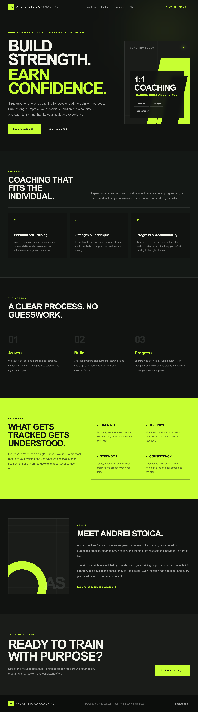

# Andrei Stoica Coaching

Andrei Stoica Coaching is a fictional personal training landing-page concept created exclusively as a web development portfolio project. It does not represent a real personal training business.

## Project Overview

This project demonstrates the design and implementation of a polished, responsive marketing page with a premium dark-charcoal and electric-lime visual direction. The experience presents a fictional coaching brand through clear content hierarchy, reusable interface patterns, and focused calls to action.

[View the live demo](https://andrei-fitness.pages.dev)

## Screenshots

### Desktop



### Mobile

<p align="center">
  
</p>

## Features

- Responsive premium landing page
- Mobile-first layout
- Functional internal navigation
- Coaching, method, progress, about, and closing CTA sections
- Accessible semantic HTML and visible keyboard focus states
- Custom favicon and SEO metadata
- Custom 404 page
- Static export deployment

## Technologies

- Next.js 16 with App Router
- React
- TypeScript
- Tailwind CSS
- Git and GitHub
- Cloudflare Pages

## Project Structure

```text
src/app/
├── globals.css       # Global styles and Tailwind configuration
├── layout.tsx        # Root layout, fonts, and metadata
├── page.tsx          # Landing page content and sections
├── not-found.tsx     # Custom 404 page
├── icon.svg          # Application icon
└── favicon.ico       # Browser favicon
next.config.ts        # Next.js static export configuration
package.json          # Dependencies and project scripts
```

## Local Development

Install dependencies:

```bash
npm install
```

Start the development server:

```bash
npm run dev
```

Run linting:

```bash
npm run lint
```

Create a production build:

```bash
npm run build
```

## Deployment

The site is deployed to Cloudflare Pages using Next.js static export. The `output: "export"` setting in `next.config.ts` generates the deployable site in the `out` directory during the production build.

## What I Practiced

- Translating a visual direction into a responsive interface
- Structuring an App Router project with semantic page sections
- Building mobile-first layouts with Tailwind CSS
- Applying accessibility considerations to navigation and interactive elements
- Configuring metadata, custom error handling, and static export deployment
- Maintaining changes with Git and GitHub
